<div align="center">




### ✨ Transformando ideas en código elegante y funcional

[](https://git.io/typing-svg)

</div>

---

## 👩‍💻 Sobre Mí

Soy una desarrolladora Full Stack apasionada por crear experiencias digitales excepcionales. Me especializo en desarrollo web con un enfoque en interfaces de usuario intuitivas y sistemas backend robustos.

```javascript
const mariaJoseTaco = {
    ubicacion: "Ecuador 🇪🇨",
    rol: "Full Stack Developer",
    pasiones: ["Código limpio", "Diseño UX/UI", "Aprendizaje continuo"],
    meta: "Construir aplicaciones que impacten positivamente",
    stack: ["Python", "Django", "PHP", "Laravel", "React", "JavaScript"]
};
```

---

## 🌐 Lenguajes

<div align="center">

[](/)
[](/)

</div>

---

## 🛠️ Stack Tecnológico

<div align="center">

### 💻 Lenguajes de Programación

[](https://python.org/)
[](https://java.com/)
[](https://cplusplus.com/)
[](https://javascript.com/)

### 🎨 Frontend

[](https://html5.org/)
[](https://css3.org/)
[](https://reactjs.org/)
[](https://getbootstrap.com/)

### ⚙️ Backend & Bases de Datos

[](https://djangoproject.com/)
[](https://php.net/)
[](https://laravel.com/)
[](https://postgresql.org/)
[](https://mysql.com/)

### 🔧 Herramientas & Dev_ops

[](https://git-scm.com/)
[](https://github.com/)
[](https://code.visualstudio.com/)
[](https://linux.org/)

</div>

---

## 💼 Experiencia Laboral

### 🚀 Práctica Laboral - Desarrollo y Programación Web

<div align="center">

**Período:** Nov 2025 - Abr 2026  
**Duración:** 240 horas

</div>

Durante mi práctica laboral en el área de Desarrollo y Programación Web, adquirí experiencia práctica en:

- **Desarrollo Web:** Creación y optimización de interfaces responsivas y accesibles
- **Backend PHP/Laravel:** Desarrollo de lógica de servidor, rutas, controladores y middleware
- **SQL & Bases de Datos:** Diseño de consultas complejas para integración de sistemas
- **Metodologías Ágiles:** Participación en sprints, seguimiento de tareas y entregables
- **Documentación Técnica:** Elaboración de documentación para mantenimiento y escalabilidad
- **QA & Testing:** Ejecución de pruebas funcionales y validación de procesos

**Habilidades desarrolladas:**
- Trabajo en equipo y colaboración interdisciplinaria
- Atención al detalle y compromiso con la calidad
- Aprendizaje continuo y adaptabilidad
- Propuesta de mejoras y optimización de procesos

---

## 📜 Certificaciones

### 🎓 Certificado de Práctica Laboral

<div align="center">

| Área | Duración | Período |
|------|----------|---------|
| Desarrollo y Programación Web | 240 horas | Nov 2025 - Abr 2026 |

**Funciones:** Desarrollo web, PHP/Laravel, SQL, metodologías ágiles, documentación técnica, pruebas de calidad

</div>

---

## 🚀 Proyectos Destacados

### ⭐ MiniAmigixV

Plataforma web moderna de productividad con IA, diseño glassmorphism y múltiples herramientas inteligentes integradas.

[](https://djangoproject.com/)
[](https://python.org/)
[](https://github.com/maria45889/MiniAmigixV/blob/main/LICENSE)

**Características principales:**
- Chat IA con múltiples proveedores (OpenAI, Groq, Ollama)
- Sistema de notificaciones avanzado
- Gestión de eventos y agenda
- Clima en tiempo real
- Traductor multilenguaje
- Panel de administración con métricas

[🔗 Ver Proyecto](https://github.com/maria45889/MiniAmigixV)

---

### 📍 GPS Tracker App

Sistema completo de rastreo GPS con aplicación móvil React Native y backend Node.js para seguimiento en tiempo real.

[](https://reactnative.dev/)
[](https://nodejs.org/)
[](https://www.typescriptlang.org/)
[](https://github.com/maria45889/GPS/blob/main/LICENSE)

**Características principales:**
- Rastreo GPS en tiempo real
- Backend con API REST y Socket.IO
- Base de datos SQLite
- Rastreo en segundo plano
- Soporte offline con cola de ubicaciones

[🔗 Ver Proyecto](https://github.com/maria45889/GPS)

---

## 📊 Estadísticas de GitHub

<div align="center">


<br><br>


<br><br>


</div>

---

## 🎯 Objetivos Actuales

<div align="center">

- [ ] Completar portafolio web personal con Next.js
- [ ] Mejorar documentación de proyectos existentes
- [ ] Agregar capturas de pantalla y demos
- [ ] Contribuir a proyectos open source
- [ ] Aprender arquitecturas cloud (AWS/GCP)

</div>

---

## 💌 Conectemos

<div align="center">

### 💬 ¡Hola! Me encantaría conocerte 💫

<p>Siempre estoy abierta a nuevos proyectos, colaboraciones y oportunidades interesantes</p>

<br>

<a href="http://wa.me/593983219145?text=Hola%20me%20llamo%20%5BTu%20Nombre%5D%20y%20me%20gusto%20tu%20trabajo.%20Quisiera%20conocerte%20%3C3">

</a>
<a href="mailto:miniamigixv@gmail.com">

</a>
<a href="https://www.tiktok.com/@miniamigixv">

</a>

<br><br>

### 👀 Visitantes del Perfil


<br><br>

---


</div>

